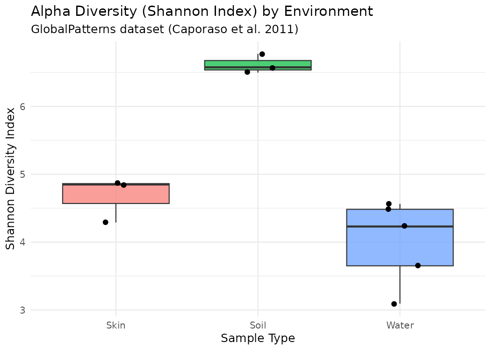
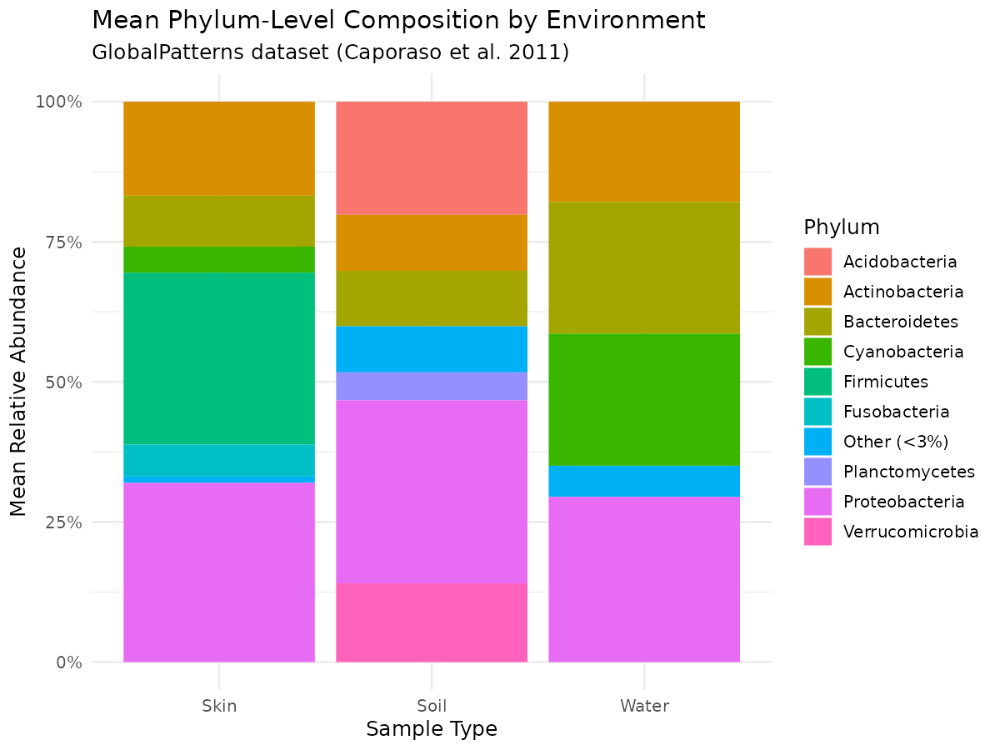
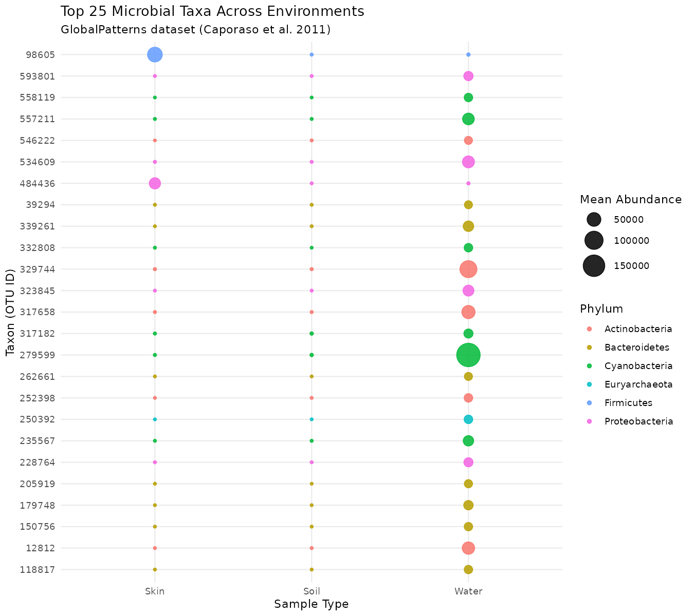

# Microbial Diversity Across Environmental Sample Types
### A comparative analysis of soil, water, and skin microbiomes using 16S rRNA survey data

## Introduction
Microbial communities differ dramatically depending on the environment they
inhabit soil, water, and skin each present very different conditions
(nutrient availability, moisture, host interaction, exposure to oxygen), and
these conditions shape which microorganisms thrive. Understanding *how* and
*how much* these communities differ is a foundational question in microbial
ecology, and has practical relevance for fields ranging from environmental
monitoring to dermatology and public health.

This project set out to explore that question directly using real,
published 16S rRNA sequencing data, rather than a toy or simulated dataset.

## Objective
To compare microbial community composition and diversity across three
environment types **Soil**, **Water** (freshwater + ocean), and **Skin**
and test whether the observed differences are statistically meaningful
rather than due to chance.

## Hypothesis
Microbial community diversity (Shannon index) and taxonomic composition
differ significantly between soil, water, and skin environments, reflecting
their distinct ecological conditions.

## Data source
[**GlobalPatterns**](https://joey711.github.io/phyloseq/)  a real 16S rRNA
microbial survey dataset from Caporaso et al. (2011), *"Global patterns of
16S rRNA diversity at a depth of millions of sequences per sample,"* PNAS
108 (Suppl 1): 4516–4522. The dataset ships directly with the R `phyloseq`
package (`data(GlobalPatterns)`), making the analysis fully reproducible
without any external download. It contains 19,216 OTUs across 26 samples
spanning multiple environments; this project uses the **Soil (n=3)**,
**Freshwater + Ocean, grouped as Water (n=5)**, and **Skin (n=3)** subsets.

## Methods
1. Loaded `GlobalPatterns` via `phyloseq` and subset to Soil, Freshwater,
   Ocean, and Skin samples; Freshwater and Ocean were grouped into a single
   "Water" category.
2. **Alpha diversity**: calculated the Shannon diversity index per sample
   using `estimate_richness()`, then compared groups with a
   **Kruskal-Wallis test** (non-parametric, appropriate for the small,
   non-normally distributed sample sizes typical of microbiome data).
3. **Composition**: collapsed taxa to Phylum level (`tax_glom`), converted
   counts to relative abundance, and summarized mean composition per
   environment.
4. **Differential abundance**: filtered to the top 25 most abundant OTUs,
   converted to a `DESeq2` dataset (`phyloseq_to_deseq2`) with environment
   as the design variable, and ran the standard `DESeq2` pipeline
   (`estimateSizeFactors(type = "poscounts")` to handle the sparse,
   zero-inflated counts typical of microbiome data, followed by `DESeq()`).
5. Visualized results with `ggplot2`: a boxplot of alpha diversity, a
   stacked bar chart of phylum-level composition, and a dot plot of
   individual taxon abundance across environments.

## Code snippet
The core of the differential abundance step (full script in `analysis.R`):

```r
# Convert to DESeq2 dataset using env_group as the design variable
dds <- phyloseq_to_deseq2(ps_top, ~ env_group)
dds <- estimateSizeFactors(dds, type = "poscounts")  # handles zero-inflated counts
dds <- DESeq(dds, fitType = "local")

res <- results(dds)
res_df <- as.data.frame(res) %>%
  mutate(taxon = rownames(res)) %>%
  filter(!is.na(padj))

# Alpha diversity: Shannon index per sample, compared across environments
alpha_df <- estimate_richness(ps, measures = "Shannon")
kruskal.test(Shannon ~ env_group, data = alpha_df)
```

## Results

### 1. Alpha diversity differs significantly by environment



Soil samples showed the highest Shannon diversity (≈6.5–6.7), skin samples
were intermediate (≈4.3–4.9), and water samples were both lowest and most
variable (≈3.1–4.6). A Kruskal-Wallis test confirmed this difference is
statistically significant: **χ² = 7.47, df = 2, p = 0.024**.

### 2. Phylum-level composition is visibly distinct per environment


Skin was dominated by **Firmicutes** (~35% mean relative abundance) and
**Proteobacteria** (~32%). Soil showed a more even spread, notably including
**Verrucomicrobia** and **Acidobacteria** — phyla essentially absent from
skin and water. Water samples were dominated by **Cyanobacteria** and
**Bacteroidetes**, consistent with photosynthetic and aquatic-adapted taxa.

### 3. Individual taxa show significant differential abundance


Of the top 25 most abundant OTUs tested with `DESeq2`, 15 had a valid
adjusted p-value, and **13 of those 15 (87%) were statistically significant
(padj < 0.05)** — meaning the large majority of dominant taxa are not just
present in different amounts by chance, but show a real, environment-linked
abundance pattern. Water samples in particular showed several
Cyanobacteria and Actinobacteria OTUs at visibly higher abundance than in
Soil or Skin.

## Discussion
All three analyses point the same direction: environment type is a strong,
consistent driver of microbial community structure in this dataset. Soil's
higher diversity likely reflects its more heterogeneous, spatially complex
habitat compared to the more selective conditions of skin (host immune
pressure, pH, temperature) or open water (nutrient limitation, dilution).
The phylum-level composition results align with established microbial
ecology findings  e.g., Firmicutes' association with skin/host-associated
environments, and Cyanobacteria's association with aquatic systems  which
is a useful internal sanity check that the pipeline is behaving as
expected on real data.

One limitation: sample sizes are small (3–5 samples per group), which is a
property of the original published dataset rather than this analysis, and
means these results should be read as illustrative rather than definitive.

## Conclusion
Soil, water, and skin microbiomes differ significantly both in overall
diversity and in specific taxonomic composition, supporting the initial
hypothesis. This project demonstrates an end-to-end microbiome analysis
workflow — from raw count data through diversity statistics, compositional
visualization, and formal differential abundance testing — entirely in R.

## Tools
- **R**, `phyloseq` (microbiome/OTU data handling)
- **DESeq2** (differential abundance testing)
- **ggplot2**, `dplyr`, `tidyr` (data wrangling and visualization)

## Files
- `analysis.R` — full, runnable script (reproducible end to end from the
  built-in dataset, no external downloads required)
- `alpha_diversity_boxplot.png` — Shannon diversity by environment
- `phylum_composition_barplot.png` — mean phylum-level composition
- `microbiome_dotplot.png` — top-taxa abundance and differential testing

